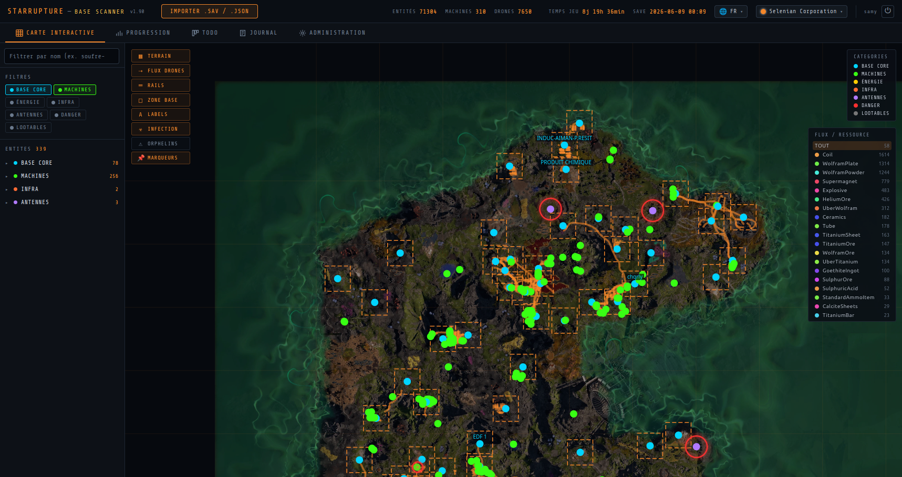
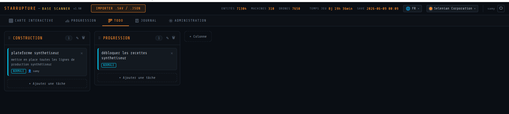
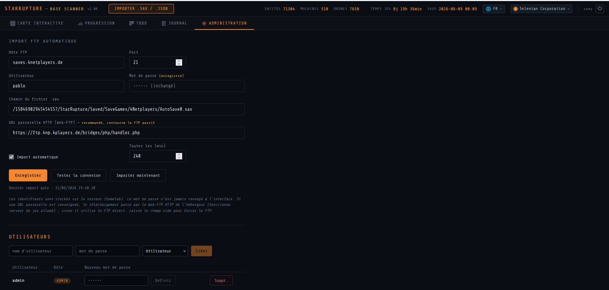

# StarRupture Base Scanner

🌍 [English](README.md) · [Français](README.fr.md) · **Deutsch** · [Español](README.es.md) · [Polski](README.pl.md)

Eine Full-Stack-Webanwendung zum Visualisieren und Analysieren von Speicherständen des Spiels **StarRupture** (Early Access, Creepy Jar).

Lade eine `.sav`-Datei hoch und erkunde deine Industriebasis auf Arcadia-7: interaktive 2D-Karte, animierte Drohnenflüsse, Produktionstabelle, Infektionswarnungen.

## Überblick

### Interaktive Karte



2D-Visualisierung der Basis: prozedurales Terrain, Maschinen, Drohnenflüsse, Schienen, Infektionszonen und Markierungen. Filtern nach Kategorie und nach Ressourcenfluss.

### TODO-Board (Kanban)



Kollaborative Aufgabenorganisation in Spalten (Konstruktion, Fortschritt) mit Prioritäten und zugewiesenen Personen.

### Administration



Automatischer FTP-Import von Speicherständen (Web-FTP-Gateway oder direktes FTP) und Benutzerverwaltung.

## Schnellstart

> 🧑‍🏫 **Neu hier?** Folge der **[Schritt-für-Schritt-Installationsanleitung](docs/INSTALLATION.de.md)** —
> sie richtet sich an nicht-technische Nutzer und erfordert nur Docker (keine technischen Vorkenntnisse nötig).

### Einfache Installation (aus dem Quellcode, nur Docker)

```bash
cd infra
# Create a .env file with DB_PASSWORD and APP_AUTH_SECRET (see the installation guide),
# then build and start:
docker compose -f docker-compose.yml -f docker-compose.build.yml up -d --build
```

Die Anwendung ist anschließend unter **http://localhost:8888** verfügbar (admin / admin beim ersten Start).

### Voraussetzungen (Entwicklung)
- Docker und Docker Compose
- Java 21 + Maven 3.9 (Backend-Entwicklung)
- Node.js 20 (Frontend-Entwicklung)

### Lokale Entwicklung

```bash
# Frontend
cd frontend && npm install && npm run dev

# Backend (requires PostgreSQL + Redis)
cd backend && mvn spring-boot:run -Dspring-boot.run.profiles=dev
```

### Produktion (Docker Compose)

```bash
cd infra
DB_PASSWORD=password \
APP_AUTH_SECRET="$(openssl rand -base64 48)" \
DOCKER_IMAGE_BACKEND=registry.example.com/backend:latest \
DOCKER_IMAGE_FRONTEND=registry.example.com/frontend:latest \
docker compose up -d
```

Die Anwendung ist auf Port **8888** verfügbar.

## Tech-Stack

| Schicht | Technologie |
|--------|-------------|
| Backend-API | Spring Boot 3.4 / Java 21 |
| Frontend | React 18 / TypeScript 5 / Vite 5 |
| Karte | Natives 2D-Canvas (prozedurales fbm-Terrain) |
| Datenbank | PostgreSQL 16 |
| Cache | Redis 7 |
| Reverse-Proxy | Nginx |
| Containerisierung | Docker Compose |
| CI/CD | Selbstgehostetes GitLab CE |

## Architektur

```
                    ┌─────────────┐
                    │   Nginx     │ :8888
                    │  (frontend) │
                    └──────┬──────┘
                           │ /api/*
                    ┌──────▼──────┐
                    │  Spring Boot│ :8080
                    │  (backend)  │
                    └──┬──────┬───┘
                       │      │
              ┌────────▼┐  ┌──▼─────┐
              │PostgreSQL│  │ Redis  │
              │  :5432   │  │ :6379  │
              └──────────┘  └────────┘
```

## Monorepo-Struktur

```
starrupture-web/
├── .gitlab-ci.yml          # CI/CD pipeline (build → package → deploy)
├── backend/                # Spring Boot REST API
│   ├── src/main/java/com/starrupture/scanner/
│   │   ├── controller/     # REST endpoints (saves, entities, links, summary)
│   │   ├── service/        # .sav parser (zlib + JSON + regex), EntityService
│   │   ├── entity/         # JPA entities (UUID primary key)
│   │   ├── dto/            # Data transfer objects
│   │   ├── repository/     # Spring Data JPA
│   │   ├── config/         # CORS, Redis cache
│   │   └── exception/      # Global error handling
│   └── src/main/resources/
│       └── db/migration/   # Flyway V1 (schema) → V11 (kanban TODO)
├── frontend/               # React + TypeScript application
│   └── src/
│       ├── components/
│       │   ├── map/        # MapCanvas, TerrainLayer, EntityLayer, DroneLayer, RailLayer
│       │   ├── table/      # ProductionTable, MiniMap, EntityDetail
│       │   └── ui/         # TabBar, Legend, Tooltip, Badge, UploadButton
│       ├── hooks/          # useSaveData, useMapInteraction, useAnimation
│       ├── pages/          # MapPage, ProgressionPage, AdminPage
│       ├── services/       # Typed Axios API
│       ├── constants/      # Colors, map configuration
│       └── types/          # TypeScript DTO types
├── infra/
│   ├── docker-compose.yml  # Services: nginx, backend, postgres, redis
│   └── nginx/nginx.conf
└── docs/
    ├── stories/            # User Stories (SR-001 to SR-012)
    └── PROGRESS.md         # Progress tracking
```

## Funktionen

### Interaktive Karte (MapPage)
- Prozedurales 2D-Terrain (fbm, außerirdische Biome)
- Entitäten mit kategoriespezifischen Farben positioniert (machine, energy, infra, antenna, danger, loot)
- Auf den Cursor zentrierter Mausrad-Zoom, Verschieben per Klicken-und-Ziehen
- Visuelles Cursor-Feedback (offene Hand beim Überfahren der Karte, geschlossen beim Verschieben, Zeiger über einer Entität)
- Hover-Hervorhebung + Tooltip, Auswahl mit Detailpanel
- **Logistikflüsse** als gebogene, nach Ressource eingefärbte Bögen, mit **animierten Richtungspfeilen** (Richtung Produzent → Konsument)
- DroneRail-Schienen (orange) und Walkway (gestricheltes Cyan)
- Visuelle Warnungen: pulsierender roter Ring bei Infektion, OFF-Badge
- **Filtern nach Name**: zeigt nur Entitäten an, deren Name passt (z. B. `sulfur-`), über alle Kategorien hinweg
- **Infektionsebene**: pulsierender roter Ring an jedem infizierten Gebäude, stets sichtbar (auch wenn die Kategorie ausgeblendet ist), ein- und ausblendbar wie die anderen Ebenen
- **Verwaiste-Ebene**: pulsierender magentafarbener Ring an PackageSender/Receiver ganz ohne Verknüpfung (weder Quelle noch Ziel), um nicht konfigurierte Transmitter aufzuspüren
- Ein- und ausblendbare Ebenen: Terrain, Drohnenflüsse, Schienen, Basiszonen, Beschriftungen, Infektion, Verwaiste
- Kategoriefilter + gruppierte Seitenliste (Kategorie → Typ), auf den sichtbaren Bereich beschränkt
- Der aktuellste Speicherstand wird beim Start automatisch geladen

### Automatischer Import (Administration)

**Administration**-Tab zum direkten Import der `.sav` vom FTP des Game-Server-Hosts, ohne manuelles Hochladen.

- FTP-Konfiguration serverseitig gespeichert (host, port, user, password, path); das Passwort wird niemals an die Oberfläche zurückgesendet
- **Web-FTP-HTTP-Gateway** (empfohlen): die `.sav` wird über die HTTP-Brücke des Hosts heruntergeladen (z. B. 4Netplayers `handler.php`), die das FTP auf LAN-Seite durchführt und die Datei über HTTPS zurückgibt. Dies umgeht den **passiven FTP-Datenkanal**, der clientseitig oft blockiert ist, und funktioniert **bei laufendem Game-Server**
- Automatischer Fallback auf direktes FTP (FTP, dann FTPS), wenn die Gateway-URL leer gelassen wird
- Manueller Import ("Jetzt importieren") oder **automatisch** in einem konfigurierbaren Intervall (`@Scheduled`)
- **Den aktuellsten Slot importieren**: zeigt der FTP-Pfad auf einen **Ordner** (endet mit `/` oder nicht mit `.sav`), listet der Import die `.sav`-Dateien im Ordner auf und lädt die nach Änderungsdatum aktuellste herunter. Das löst das Slot-Rotationsproblem von `AutoSave0`/`1`/`2` auf dem Game-Server (ein Pfad, der auf eine feste Datei zeigt, bleibt abwärtskompatibel)
- **Wipe-and-Replace**: jedes Laden eines Speicherstands (manuelles Hochladen **oder** FTP-Import) löscht zunächst die vorhandenen Sitzungen und lädt die `.sav` anschließend frisch neu — so behält die Anwendung immer nur einen einzigen Zustand (den zuletzt geladenen). Gemeinsame Logik in `parseSavBytes`, atomar (`@Transactional`): scheitert das Parsen, wird das Löschen zurückgerollt
- **Batch-Inserts**: das Parsen wird durch Hibernate-JDBC-Batching beschleunigt (`batch_size`, `order_inserts`, `reWriteBatchedInserts`) — unverzichtbar bei Speicherständen mit Zehntausenden von Entitäten
- **"Identischer Speicherstand"-Schutz**: beim Import vergleicht das Backend den **SHA-256-Hash des Rohinhalts** der neuen `.sav` mit dem vorherigen. Ist er unverändert, ist die Datei bis aufs Bit identisch — das Spiel hat keinen neuen Speicherstand geschrieben (eingefrorene Datei): ein **Warn-Banner** erscheint im Header. Der Inhalts-Hash ist dort zuverlässig, wo der alte Vergleich aus `timestamp` + `playtime` fälschlich auf "identisch" schloss, sobald diese beiden Felder zufällig übereinstimmten (für Altsitzungen ohne Hash wird auf diesen Vergleich zurückgegriffen). Das im Header angezeigte Datum ist das **interne Datum des Speicherstands** (wann das Spiel ihn geschrieben hat), nicht das Upload-Datum — was eine veraltete Datei selbst dann verrät, wenn ihr Download-Datum aktuell wirkt

### Authentifizierung

Die Anwendung ist durch einen **Login-Bildschirm** geschützt. Leichtgewichtige Authentifizierung ohne externe Abhängigkeit:

- Passwörter mit **PBKDF2-HMAC-SHA256** gehasht, API-Tokens **HMAC-signiert** (zustandslos, clientseitig in `localStorage` gespeichert)
- Ein **Standard-Admin** (`admin` / `admin`) wird beim ersten Start angelegt, wenn noch kein Konto existiert — **ändere ihn sofort** über die Oberfläche (konfigurierbar über `APP_ADMIN_USER`/`APP_ADMIN_PASSWORD`)
- Der **Administrator** verwaltet Konten (Erstellen, Passwort setzen, Löschen, Rolle ADMIN/USER) im Administration-Tab
- Jede `/api/**`-Route erfordert ein gültiges Token; `/api/admin/**` erfordert die Rolle ADMIN. Der Administration-Tab wird für Nicht-Admin-Nutzer ausgeblendet
- Signaturgeheimnis **erforderlich** über `APP_AUTH_SECRET`: die Anwendung **verweigert den Start**, wenn es nicht gesetzt ist (kein Standardwert, um ein geteiltes Geheimnis zu vermeiden, mit dem sich Tokens fälschen ließen). Generiere eines mit `openssl rand -base64 48`

### Kollaborative Markierungen

**Rechtsklick** auf der Karte, um eine **annotierte Markierung** zu setzen (Pin mit Beschriftung). Markierungen sind für alle Spieler sichtbar, in der Datenbank gespeichert und erscheinen auf einer eigenen Ebene (ein- und ausblendbar). Liste mit Löschfunktion in der Seitenleiste.

### Logbuch (Import-Diff)

**LOGBOOK**-Tab: bei jedem Import vergleicht das Backend automatisch den neuen Zustand mit dem vorherigen Snapshot und erzeugt eine **Zusammenfassung der Änderungen**:
- **Spielzeit**-Delta, Metriken (Entitäten, ausgeschaltete Maschinen, volle Ausgänge, Infektionen…)
- Veränderungen **nach Entitätskategorie**
- **Neu freigeschaltete Rezepte**
- **Entitätstypen**, die aufgetaucht oder verschwunden sind

Der Diff wird auf der Sitzung gespeichert (`import_diff`) und ist jederzeit einsehbar.

### TODO-Board (Kanban)

**TODO**-Tab: ein über alle Spieler **geteiltes** Kanban-Board zur Organisation von Basisprojekten.

- **Anpassbare Spalten**: erstellen, umbenennen, löschen, **per Drag-and-drop neu anordnen** (⠿ Griff am Spaltenkopf) — standardmäßig To do / In progress / Done
- **Aufgaben** mit Titel, Beschreibung, **Priorität** (low/normal/high, farbiger Punkt), **zugewiesener Person** (unter den vorhandenen Konten) und **Fälligkeitsdatum** (hervorgehoben, wenn überfällig)
- **Drag-and-drop** von Karten zwischen Spalten und Neuanordnung (natives HTML5-Drag-and-drop, ohne Abhängigkeit)
- Jede Aufgabe merkt sich ihren **Autor** (aktueller Nutzer)
- Daten **unabhängig von Speicherständen**: das Kanban wird vom Wipe-and-Replace des Imports nie gelöscht

### Grafische Themes

Theme-Auswahl im Header: der Akzent der gesamten Oberfläche passt sich an die **Identität einer StarRupture-Corporation** an.

- 6 dunkle Themes: **Terminal** (cyan/grün, Standard), **Selenian** (orange), **Moon Energy** (silber/cyan), **Clever Robotics** (rot), **Future Health** (türkis), **Griffith Blue** (blau) — sie ändern nur den **Akzent**
- 1 **Light**-Theme: helle Hintergründe + abgedunkelter Akzent für Kontrast — es definiert zusätzlich die Neutraltöne neu (Hintergründe, Rahmen, Text)
- Umgesetzt als **CSS-Variablen**: Akzent (`--accent`, `--accent-2` + `-rgb`-Tripel) und Neutraltöne (`--bg*`, `--border*`, `--text*`), angewendet über `[data-theme]` am `<html>`; die Wahl wird in `localStorage` **gespeichert**
- Der Akzent erstreckt sich bis zur **Karte**: Umriss der Basiszone, Walkways und Raster folgen dem Theme (das Canvas-Rendering liest `THEME_ACCENTS`, synchron mit den CSS-Variablen)
- Die **semantischen Farben der Entitätskategorien** (Karte) bleiben zur besseren Lesbarkeit unverändert

### Mehrsprachige Oberfläche

Die gesamte Oberfläche ist in **5 Sprachen** übersetzt: **Englisch** (Standard), **Französisch**, **Deutsch**, **Spanisch**, **Polnisch**.

- Sprachauswahl (🌐) im Header und auf der Login-Seite
- Umgesetzt mit **react-i18next**; Übersetzungsdateien pro Sprache in `frontend/src/i18n/locales/`
- Die gewählte Sprache wird **im Benutzerprofil gespeichert** (serverseitig) und bei jedem Login erneut angewendet, zusätzlich zur Speicherung in `localStorage`
- **Spieldaten** (Entitätsnamen, Rezepte) und **Eigennamen** (Corporations) werden nicht übersetzt

### REST-API

> Alle `/api/**`-Routen (außer `/api/auth/login`) erfordern den Header `Authorization: Bearer <token>`.

| Methode | Endpunkt | Beschreibung |
|---------|----------------|-------------|
| POST | `/api/auth/login` | Login → signiertes Token (öffentlich) |
| GET | `/api/auth/me` | Aktueller Nutzer (Name, Rolle, Sprache) |
| PUT | `/api/auth/me/language` | Sprache des aktuellen Nutzers ändern |
| GET / POST | `/api/admin/users` | Nutzer auflisten / erstellen (ADMIN) |
| PUT | `/api/admin/users/{id}/password` | Passwort setzen (ADMIN) |
| DELETE | `/api/admin/users/{id}` | Nutzer löschen (ADMIN) |

| Methode | Endpunkt | Beschreibung |
|---------|----------------|-------------|
| POST | `/api/saves` | Eine `.sav`-Datei hochladen und parsen |
| GET | `/api/saves` | Sitzungen auflisten |
| DELETE | `/api/saves/{id}` | Eine Sitzung löschen |
| GET | `/api/saves/{id}/entities` | Entitäten (filterbar über `?cat=`) |
| GET | `/api/saves/{id}/links` | Drohnenflüsse |
| GET | `/api/saves/{id}/splines` | Schienen und Splines |
| GET | `/api/saves/{id}/zones` | Basiszonen (Bounding Boxes) |
| GET | `/api/saves/{id}/summary` | Aggregierte Statistiken |
| GET | `/api/saves/{id}/progression` | Corporations, freigeschaltete/gesperrte Blueprints + gesammelte Items |
| GET / PUT | `/api/admin/config` | FTP-Import-Konfiguration lesen / schreiben |
| POST | `/api/admin/test` | Verbindungstest (HTTP-Gateway oder FTP) |
| POST | `/api/admin/import` | Sofortiger Import der `.sav` von FTP/Gateway |

| Methode | Endpunkt | Beschreibung |
|---------|----------------|-------------|
| GET | `/api/kanban/board` | Vollständiges Kanban-Board (Spalten + Aufgaben) |
| GET | `/api/kanban/users` | Nutzerliste (für Zuweisung) |
| POST / PUT / DELETE | `/api/kanban/columns[/{id}]` | Eine Spalte erstellen / umbenennen / löschen |
| POST / PUT / DELETE | `/api/kanban/tasks[/{id}]` | Eine Aufgabe erstellen / bearbeiten / löschen |
| PUT | `/api/kanban/tasks/{id}/move` | Eine Aufgabe verschieben (Spalte + Position) |

## CI/CD-Pipeline

```
build (backend JAR + frontend dist)
  → package (Docker images → GitLab Container Registry)
    → deploy (scp compose/nginx + docker compose pull/up on the server)
```

- **main** → **automatische Produktionsbereitstellung** (Direktauslieferung, ohne Freigabe)
- Einzelner `main → prod`-Flow: kein `develop`-/Staging-Branch

## Fortschritt

| Sprint | Punkte | Status |
|--------|--------|--------|
| S1 — Grundlagen (Upload, Parser, Karte, Zoom) | 26 | Erledigt |
| S2 — Erweiterte Visualisierung (Drohnen, Schienen, Tabelle, Minimap, Warnungen) | 24 | Erledigt |
| S3 — Filter und CI/CD | 11 | Erledigt |
| **Gesamt** | **61** | Erledigt |

## Lizenz

Veröffentlicht unter der **MIT**-Lizenz — siehe die Datei [LICENSE](LICENSE). Du darfst
diesen Code frei verwenden, modifizieren und weiterverbreiten, auch für kommerzielle Zwecke,
sofern du den Copyright-Hinweis beibehältst.
